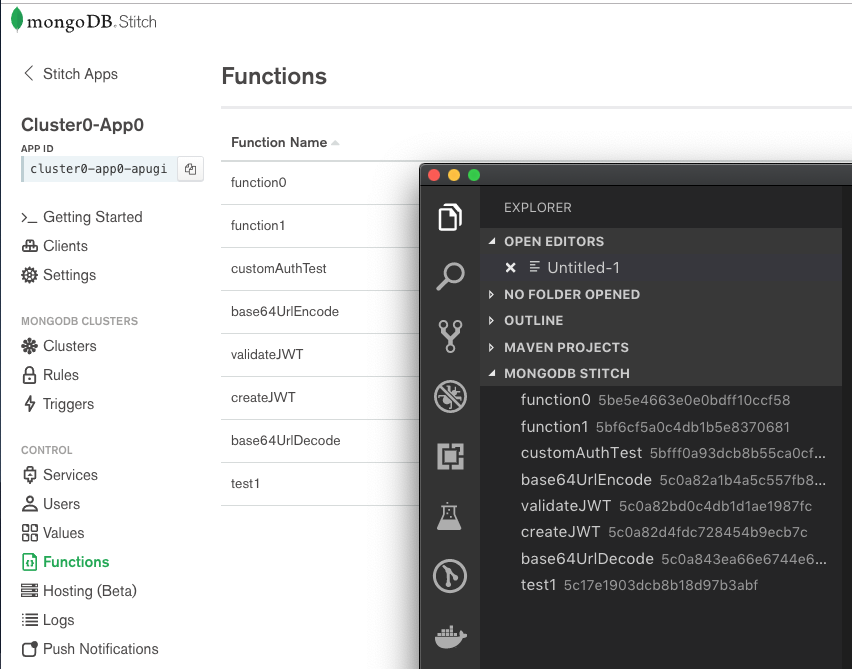

# vscode-mongodb-stitch

This extension allows you to interact with your MongoDB Stitch applications directly from vscode.

**This extension is not officially developed or supported by MongoDB Inc.**

## TODO

Functions
- [x] List
- [ ] Load
- [ ] Save

Values
- [ ] List
- [ ] Load
- [ ] Save

Triggers
- [ ] List
- [ ] Load
- [ ] Save

- [ ] Integrate with Git
- [ ] Export/Import

## Features

* List your Stitch Functions

## Requirements

* A [MongoDB Atlas](https://www.mongodb.com/cloud/atlas) cluster
* A [MongoDB Stitch](https://www.mongodb.com/cloud/stitch) application associated with your Atlas cluster

## Extension Settings

**TODO**

Include if your extension adds any VS Code settings through the `contributes.configuration` extension point.

For example:

This extension contributes the following settings:

* `myExtension.enable`: enable/disable this extension
* `myExtension.thing`: set to `blah` to do something

## Release Notes

Users appreciate release notes as you update your extension.

### 0.1 DEVEL

* Configuration sections added
* Initial function list can be populated

---

## License

MIT License

Copyright (c) Alex Bevilacqua. All rights reserved.

Permission is hereby granted, free of charge, to any person obtaining a copy
of this software and associated documentation files (the "Software"), to deal
in the Software without restriction, including without limitation the rights
to use, copy, modify, merge, publish, distribute, sublicense, and/or sell
copies of the Software, and to permit persons to whom the Software is
furnished to do so, subject to the following conditions:

The above copyright notice and this permission notice shall be included in all
copies or substantial portions of the Software.

THE SOFTWARE IS PROVIDED "AS IS", WITHOUT WARRANTY OF ANY KIND, EXPRESS OR
IMPLIED, INCLUDING BUT NOT LIMITED TO THE WARRANTIES OF MERCHANTABILITY,
FITNESS FOR A PARTICULAR PURPOSE AND NONINFRINGEMENT. IN NO EVENT SHALL THE
AUTHORS OR COPYRIGHT HOLDERS BE LIABLE FOR ANY CLAIM, DAMAGES OR OTHER
LIABILITY, WHETHER IN AN ACTION OF CONTRACT, TORT OR OTHERWISE, ARISING FROM,
OUT OF OR IN CONNECTION WITH THE SOFTWARE OR THE USE OR OTHER DEALINGS IN THE
SOFTWARE